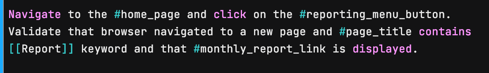
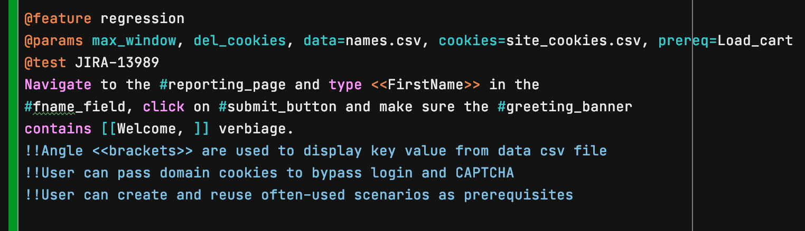
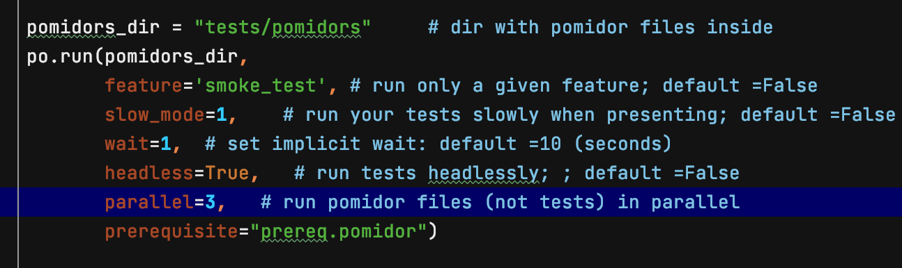

# pomidor 0.0.2-Alpha

:tomato:
# **A BDD-style Selenium-driven browser automation(Python) - First Production release coming soon** 
## (with Agile in mind :nerd_face: )
### Fast and flexible approach to automating `click()`, `send_keys()`, `is_displayed()` and many other selenium actions and asserts straight from your Jira/TFS stories 

### Example:

>In the picture above, you can see that __page objects__ are marked with hashtags. Ex. **#home_page**

### Markers:

>Add __@feature__, __@params__  and __@test__ to personalize your tests:

### Quick Start:
Install pomidor

Create a csv file that contains page objects additional urls. (Example shown below)

Write your first test_case.pomidor file (extension must be ".pomidor") and place it in dedicated folder (Ex.: pomidor_files):

Create a runner file, import Pomidor class and run your first test as shown below:

Add additional functionality to your test:

Run your first Automation test! :rocket:

