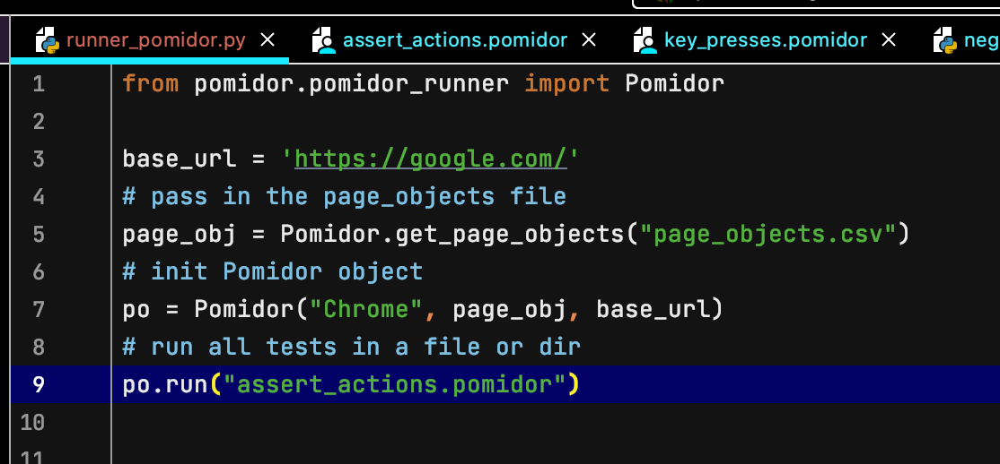

# pomidor 0.0.2-Alpha

:tomato:
# **A BDD-style Selenium-driven browser automation on Python** 
## (with Agile in mind :nerd_face: )
### Fast and flexible approach to automating `click()` and `send_keys()` selenium actions straight from your Jira stories 

### Example:

>Here, you can see that __action__ is prepended with a star (__*click__) and __page object__ is marked with hashtag (**#contact_us**).

Note: To accomodate natural language, any variations of actions are allowed,
as long as the root stays unchanged: 
Example: ***Click**ed or ***tyPE**d

### Quick Start:
Install pomidor

Create a Page Factory class with a dictionary that contains page objects. (Example shown below)

Write your first test_case.pomidor file (extension must be ".pomidor") and place it in dedicated folder (Ex.: pomidor_files):

Create a runner file, import page factory dictionary, Pomidor class and exceptions (keep in mind, your page objects package name may differ from what's shown below)

In the same runner file, specify url and page object instance, and pass them to Pomidor class instance. Then, run your first test case as shown below:

Run your first Automation test! :rocket:

# Next in development:
- asserts with *displayed and *selected

# PyCharm plugin developers for ".pomidor" extension needed!

Clone it, fork it, bring any new ideas.

