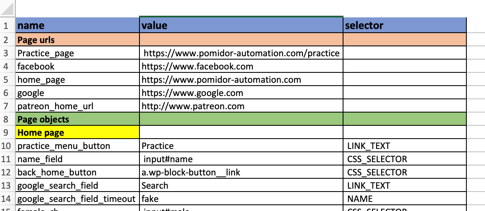

# pomidor

:tomato:
# **A BDD-style Selenium-driven browser automation with Python** 
## (with Agile in mind :nerd_face: )
### Fast and flexible approach to automating `click()` and `send_keys()` selenium actions straight from your Jira stories 

### Example:

>Here, you can see that __action__ is prepended with a star (__*click__) and __page object__ is marked with hashtag (**#contact_us**).

Note: To accomodate natural language, any variations of actions are allowed,
as long as the root stays unchanged: 
Example: ***Click**ed or ***tyPE**d

### Quick Start:
1. >**pip install pomidor**

2. Create a Page Factory class with a dictionary, like shown below:

3. Write your first Pomidor test case and place it in dedicated folder (Ex.: pomidor_files):

4. Create a runner file, import page factory dictionary, specify url and point to a test.pomidor directory as shown below:

5. Run your first Automation test! :rocket:

