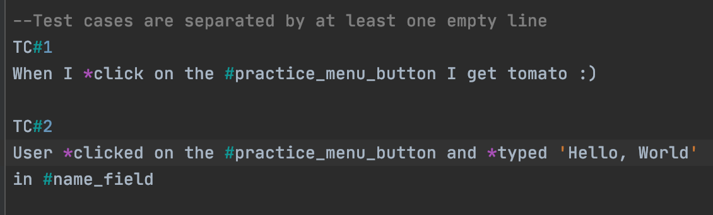

# pomidor

:tomato:
# **BDD-style, Selenium-driven browser automation with Python**
##(with Agile in mind :) )
### A simple and code-less approach to automating `click()` and `send_keys()` selenium actions straight from your Jira stories 

### Example:

Here, you can see that actions prepended with "*" (*click) and page object is marked with "#" (#contact_us).

Note: To accomodate natural language, any variations of actions are allowed,
as long as the root stays unchanged: 
Example: __*Click__ed or __*tyPE__d

### Quick Start:
1. Create a Page Factory class like so:

2. Write your first Pomidor test case:

3. Create a runner file, import page factory dictionary and point to a test.pomidor directory as shown below:

4. Run your first Automation test! 
